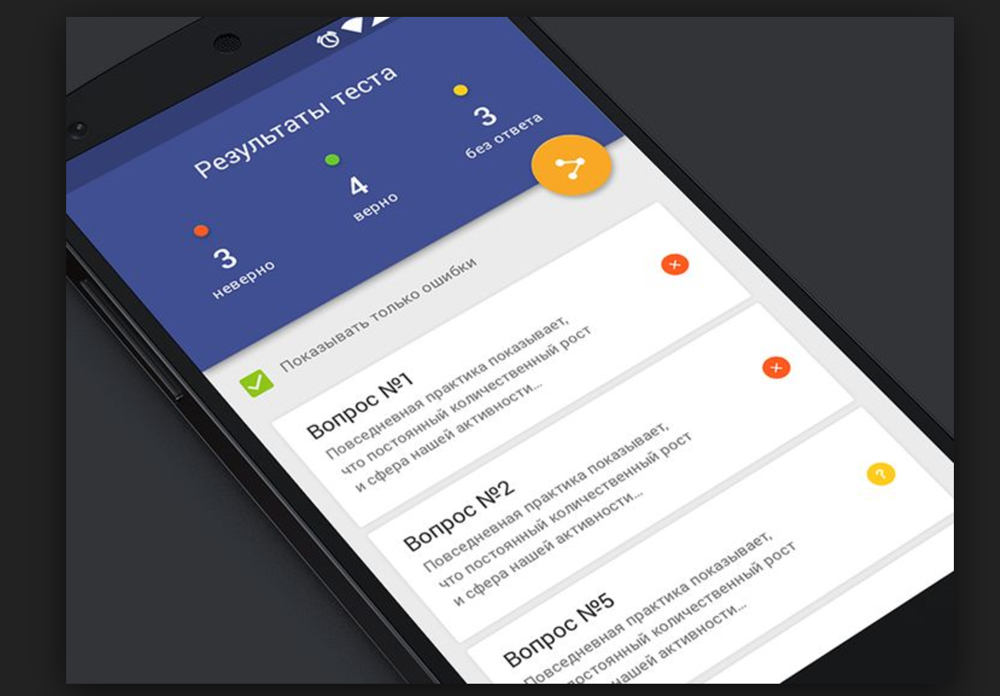
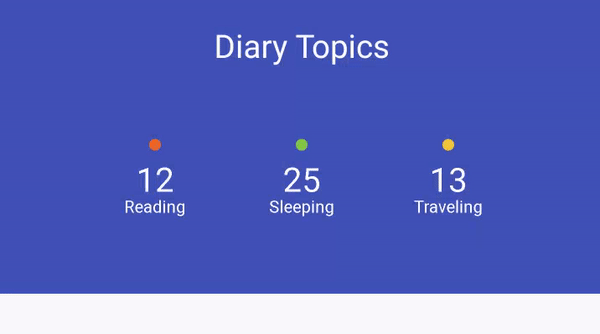

# ColorStatisticsViewProject
 

# About
Color Statistics for Android based on a Material Up showcase designed by [Someone](https://github.com/wotomas/ColorStatisticsViewProject#notes-1)

# Demo
[]()
[]()

## Implement
```gradle
dependencies {
  compile 'info.kimjihyok:color-statistics-view:0.1.0'
}
```

```XML
<info.kimjihyok.coloverstatisticsview.ColorStatisticsView
    android:id="@+id/colorStatsView"
    android:layout_width="match_parent"
    android:layout_height="200dp">
</info.kimjihyok.coloverstatisticsview.ColorStatisticsView>
```

```java
colorStatsView = (ColorStatisticsView) findViewById(R.id.colorStatsView);
colorStatsView.setBackgroundColor(ContextCompat.getColor(this, R.color.colorPrimary));
colorStatsView.setTitleText("Diary Topics");
colorStatsView.setFontColor(ContextCompat.getColor(this, R.color.white));
colorStatsView.setFontSize(22);
colorStatsView.setStatisticsItems(getDummyData());

// to update values
colorStatsView/.setStatValue(position, value);
```


### Notes
 - <a name="note-1"></a> Please help me update this link. I saw it on Material Up, but lost the link and can't find him!
